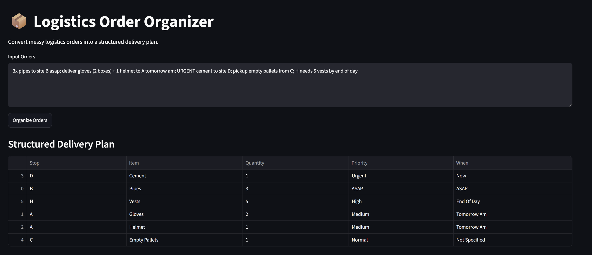
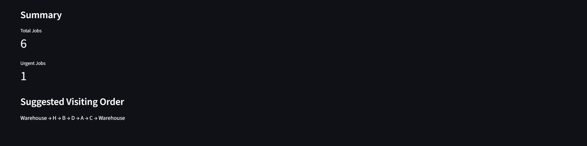

# Logistics Order Organizer

## Overview

Logistics Order Organizer is a lightweight logistics tool that converts messy delivery orders into a structured delivery plan.

The application reads unstructured logistics text, extracts key information using a rule-based parser with Regular Expressions (Regex), organizes the extracted data into a clean table, sorts jobs by priority, and displays the results through a Streamlit interface.

As a bonus, the application generates a suggested visiting route using the provided coordinates.

---

## Features

* Parse unstructured logistics orders
* Extract Stop, Item, Quantity, Priority, and Delivery Time
* Handle multiple items within a single order
* Clean noisy text before extracting item names
* Sort jobs by priority
* Display the results in a Streamlit interface
* Generate a suggested visiting route (Bonus)

---

## Project Structure

```text
Logistics-Order-Organizer/
│
├── app.py
├── parser.py
├── route_optimizer.py
├── sample_input.txt
├── requirements.txt
└── README.md
```

---

## Requirements

* Python 3.x
* pandas
* streamlit

Install the required packages:

```bash
pip install -r requirements.txt
```

---

## How to Run

```bash
streamlit run app.py
```

---

## Sample Data

The project uses the sample logistics orders provided in the challenge.

```text
3x pipes to site B asap; deliver gloves (2 boxes) + 1 helmet to A tomorrow am; URGENT cement to site D; pickup empty pallets from C; H needs 5 vests by end of day
```

---

## Parsing Strategy

The parser follows a lightweight rule-based approach.

The input text is first split into individual delivery orders. Each order is then analyzed to extract:

* Stop
* Item
* Quantity
* Priority
* Delivery Time

Instead of matching one specific sentence, the parser relies on reusable Regular Expressions (Regex) and keyword dictionaries, making it flexible enough to handle similar logistics orders with different wording.

---

## Bonus Feature

The application generates a suggested visiting order using the provided coordinates.

Starting from the Warehouse, it builds a suggested route by selecting the closest remaining stop at each step before returning to the Warehouse.

---

## Design Decisions

I initially considered using NLP libraries for information extraction. However, after evaluating the project requirements, I decided that a rule-based parser was a better fit. Since the input is relatively small and follows predictable logistics patterns, using Regular Expressions (Regex) and reusable keyword dictionaries provided a simpler, more efficient, and easier-to-maintain solution.

---

## AI Usage

### What I asked AI to help with

* Planning the project structure
* Brainstorming the parsing approach
* Regex suggestions
* Streamlit interface
* Debugging and explaining the code

### What I changed myself

* Refactored the code into reusable functions
* Generalized the parser instead of making it specific to the provided sample
* Created reusable keyword dictionaries for priorities, delivery times, and noise words
* Improved the extraction rules to recognize common logistics patterns instead of exact sentences
* Added a data-cleaning step to remove unnecessary words before extracting item names
* Improved variable names, comments, and overall code readability
* Implemented the route suggestion based on the provided coordinates

### Issues I fixed

* Item names initially contained unnecessary words such as action verbs, scheduling terms, and location letters. I solved this by introducing a noise-word cleaning step before storing the extracted item.
* The suggested route section initially produced an error because it attempted to access the parsed data before it was generated. I fixed this by displaying the route only after generating the delivery plan and showing a default message beforehand.

## Example Output




